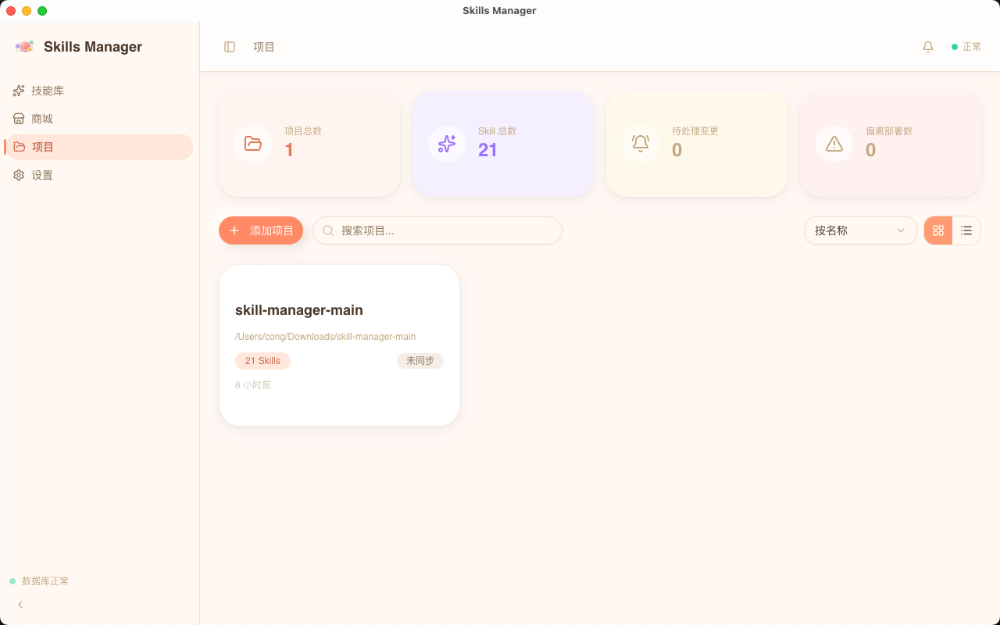
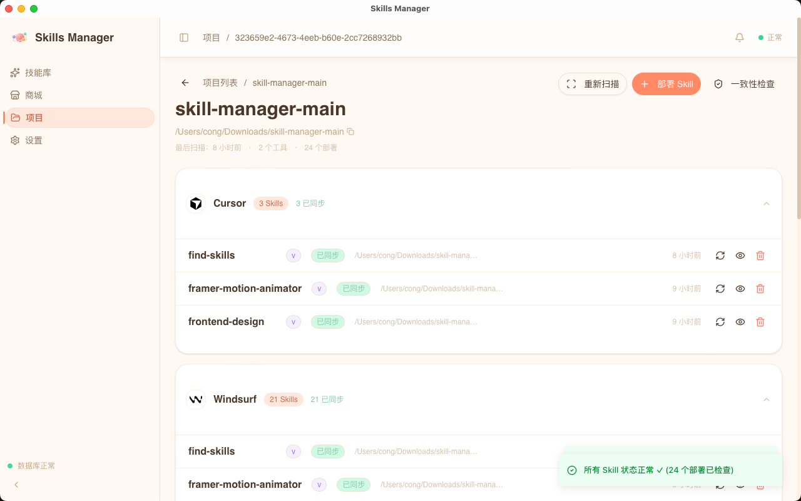
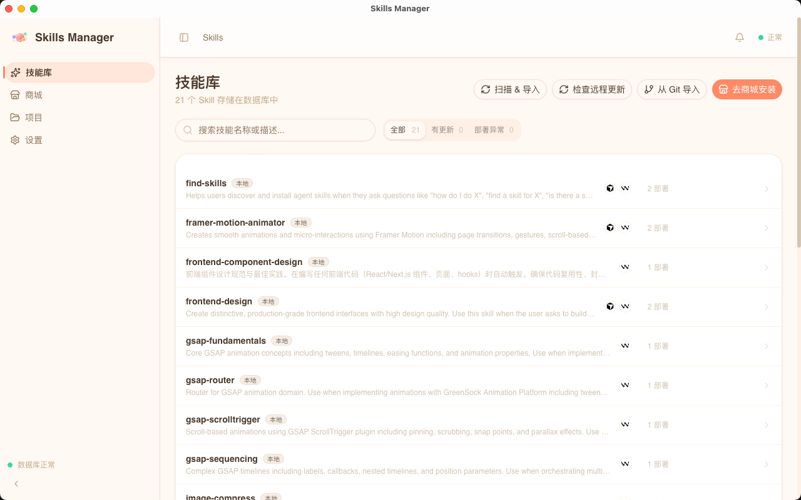
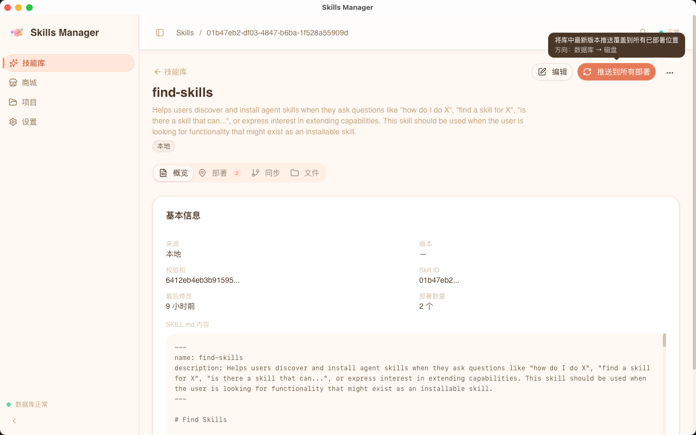
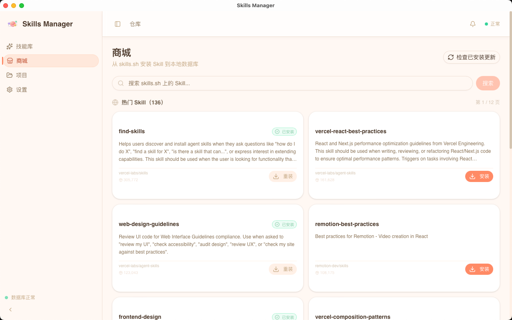
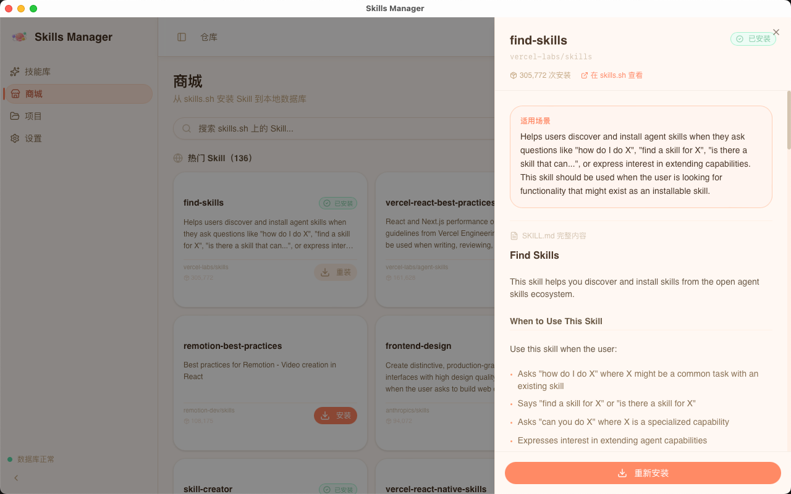
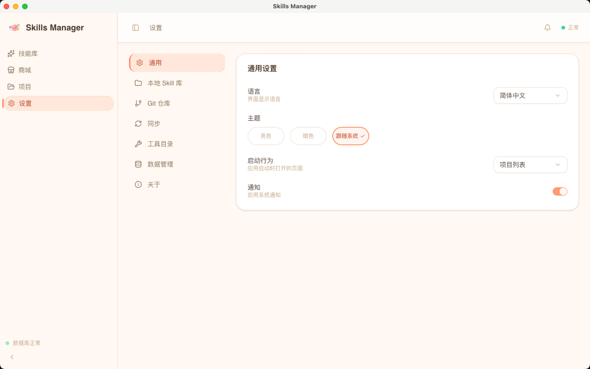
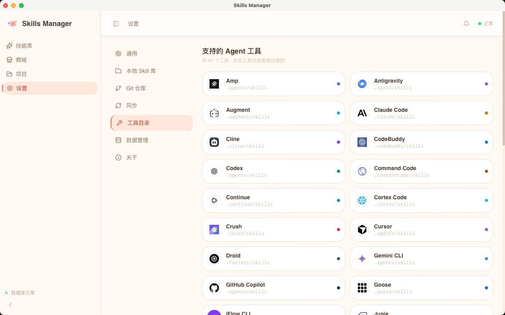
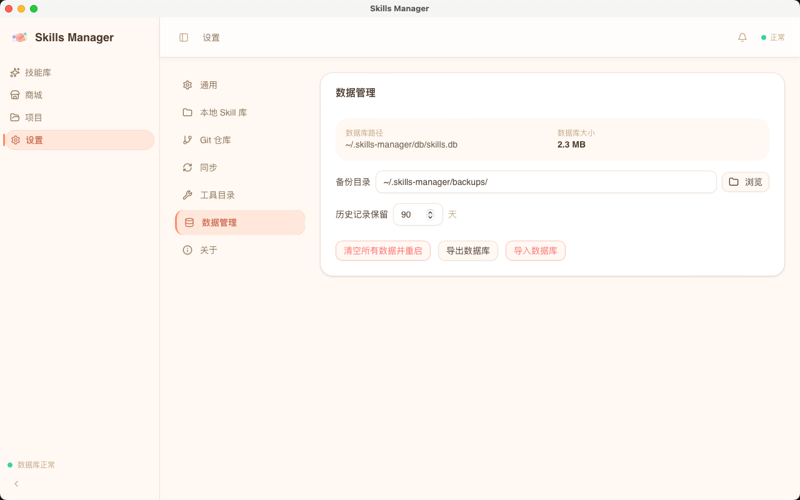

# Skills Manager

> 一款跨平台 AI 编码工具 **Skill 统一管理器**，支持 **40+ AI 编码工具**，导入项目、发现并管理各工具的 Skill，连接 [skills.sh](https://skills.sh/) 在线仓库进行安装/更新，并提供一键备份同步至 GitHub / Gitee 远程仓库的能力。

---

## 截图预览

### 项目管理



> 导入本地项目后自动扫描，按工具（40+ AI 编码工具）分组展示已部署的 Skill，支持网格/列表视图切换。



> 在项目详情中可查看每个 AI 工具下已部署的 Skill 状态（已同步 / 有变更 / 缺失），支持一键同步、重新部署、移除。

---

### Skill 库



> 统一管理本地 Skill 库：查看所有 Skill、筛选有更新/部署异常的条目、检查远程版本更新、从 Git 仓库导入。



> 编辑 Skill 内容、查看部署状态、手动触发同步至文件系统，以及将 Skill 推送到 GitHub / Gitee。

---

### Skill 商店（skills.sh）



> 浏览 [skills.sh](https://skills.sh/) 在线仓库，按工具类型筛选，分页浏览并一键安装到本地 Skill 库。



> 查看 Skill 的完整说明文档、触发场景、版本信息，安装前可全文预览。

---

### 设置

| 通用设置 | Git 仓库 | 工具目录 | 数据管理 |
|:---:|:---:|:---:|:---:|
|  |  |  |  |

---

## 核心功能

| 功能模块 | 说明 |
|---|---|
| **项目管理** | 导入本地项目、一键扫描发现各 AI 工具下的 Skill 文件 |
| **Skill 库** | 本地统一存储，查看、编辑、版本对比、更新检查 |
| **Skill 商店** | 连接 skills.sh 在线仓库，搜索安装社区 Skill |
| **Git 导入** | Clone GitHub / Gitee 仓库，批量导入 Skill |
| **多工具支持** | Amp · Antigravity · Augment · Claude Code · Cline · CodeBuddy · Codex · Command Code · Continue · Cortex Code · Crush · Cursor · Droid · Gemini CLI · GitHub Copilot · Goose · iFlow CLI · Junie · Kilo Code · Kimi Code CLI · Kiro CLI · Kode · MCPJam · Mistral Vibe · Mux · OpenClaw · OpenCode · OpenHands · Pi · Qoder · Qwen Code · Replit · Roo Code · Trae · Trae CN · Universal · Windsurf · Zencoder · Neovate · Pochi · AdaL |
| **部署管理** | 将 Skill 从统一库部署到指定项目的对应工具目录 |
| **同步推送** | 将本地变更推送到 GitHub / Gitee 备份仓库 |
| **数据管理** | 本地 SQLite 数据库，支持导出/导入/一键恢复出厂 |

---

## 管理路径流程

```
┌─────────────────────────────────────────────────────────────────┐
│                         技能来源（三条路径）                         │
├──────────────┬──────────────────────────┬───────────────────────┤
│   本地项目扫描    │       skills.sh 商店        │    Git 仓库导入         │
│              │                          │                       │
│  导入项目目录    │  搜索/浏览在线 Skill 商店     │  填入 Git 仓库地址       │
│      ↓       │           ↓              │        ↓              │
│  自动扫描工具    │  查看详情 & 一键安装          │  Clone 仓库到本地        │
│  配置目录找到    │           ↓              │        ↓              │
│  SKILL.md    │  写入本地 Skill 库           │  选择要导入的 Skill       │
└──────┬───────┴──────────┬───────────────┴──────────┬────────────┘
       │                  │                           │
       └──────────────────▼───────────────────────────┘
                          │
                   ┌──────▼──────┐
                   │  本地 Skill 库  │
                   │  (SQLite DB)  │
                   └──────┬──────┘
                          │
          ┌───────────────┼───────────────┐
          │               │               │
          ▼               ▼               ▼
     查看 / 编辑       检查远程更新       部署到项目
     Skill 内容       (skills.sh)      ┌──────────────┐
          │               │            │  选择目标项目   │
          │               ▼            │  选择工具类型   │
          │          有更新 → 一键更新   │  (Cursor等)   │
          │                            └──────┬───────┘
          │                                   │
          ▼                                   ▼
   同步到文件系统                      写入项目工具目录
  (~/.cursor/skills/             ({project}/.cursor/skills/
   ~/.windsurf/skills/ 等)         .windsurf/skills/ 等)
          │                                   │
          ▼                                   ▼
   推送到 Git 远程仓库               项目详情查看部署状态
  (GitHub / Gitee 备份)            已同步 / 有变更 / 缺失
                                           │
                                           ▼
                                    一键同步 / 重新部署
```

---

## 支持的 AI 工具

| 工具 | 项目级路径 | 全局路径 |
|---|---|---|
| **Amp** | `{project}/.agents/skills/` | `~/.config/agents/skills/` |
| **Antigravity** | `{project}/.agent/skills/` | `~/.gemini/antigravity/skills/` |
| **Augment** | `{project}/.augment/skills/` | `~/.augment/skills/` |
| **Claude Code** | `{project}/.claude/skills/` | `~/.claude/skills/` |
| **Cline** | `{project}/.cline/skills/` | `~/.cline/skills/` |
| **CodeBuddy** | `{project}/.codebuddy/skills/` | `~/.codebuddy/skills/` |
| **Codex** | `{project}/.agents/skills/` | `~/.codex/skills/` |
| **Command Code** | `{project}/.commandcode/skills/` | `~/.commandcode/skills/` |
| **Continue** | `{project}/.continue/skills/` | `~/.continue/skills/` |
| **Cortex Code** | `{project}/.cortex/skills/` | `~/.snowflake/cortex/skills/` |
| **Crush** | `{project}/.crush/skills/` | `~/.config/crush/skills/` |
| **Cursor** | `{project}/.agents/skills/` | `~/.cursor/skills/` |
| **Droid** | `{project}/.factory/skills/` | `~/.factory/skills/` |
| **Gemini CLI** | `{project}/.agents/skills/` | `~/.gemini/skills/` |
| **GitHub Copilot** | `{project}/.agents/skills/` | `~/.copilot/skills/` |
| **Goose** | `{project}/.goose/skills/` | `~/.config/goose/skills/` |
| **iFlow CLI** | `{project}/.iflow/skills/` | `~/.iflow/skills/` |
| **Junie** | `{project}/.junie/skills/` | `~/.junie/skills/` |
| **Kilo Code** | `{project}/.kilocode/skills/` | `~/.kilocode/skills/` |
| **Kimi Code CLI** | `{project}/.agents/skills/` | `~/.config/agents/skills/` |
| **Kiro CLI** | `{project}/.kiro/skills/` | `~/.kiro/skills/` |
| **Kode** | `{project}/.kode/skills/` | `~/.kode/skills/` |
| **MCPJam** | `{project}/.mcpjam/skills/` | `~/.mcpjam/skills/` |
| **Mistral Vibe** | `{project}/.vibe/skills/` | `~/.vibe/skills/` |
| **Mux** | `{project}/.mux/skills/` | `~/.mux/skills/` |
| **OpenClaw** | `{project}/skills/` | `~/.openclaw/skills/` |
| **OpenCode** | `{project}/.agents/skills/` | `~/.config/opencode/skills/` |
| **OpenHands** | `{project}/.openhands/skills/` | `~/.openhands/skills/` |
| **Pi** | `{project}/.pi/skills/` | `~/.pi/agent/skills/` |
| **Qoder** | `{project}/.qoder/skills/` | `~/.qoder/skills/` |
| **Qwen Code** | `{project}/.qwen/skills/` | `~/.qwen/skills/` |
| **Replit** | `{project}/.agents/skills/` | `~/.config/agents/skills/` |
| **Roo Code** | `{project}/.roo/skills/` | `~/.roo/skills/` |
| **Trae** | `{project}/.trae/skills/` | `~/.trae/skills/` |
| **Trae CN** | `{project}/.trae/skills/` | `~/.trae-cn/skills/` |
| **Universal** | `{project}/.agents/skills/` | `~/.config/agents/skills/` |
| **Windsurf** | `{project}/.windsurf/skills/` | `~/.codeium/windsurf/skills/` |
| **Zencoder** | `{project}/.zencoder/skills/` | `~/.zencoder/skills/` |
| **Neovate** | `{project}/.neovate/skills/` | `~/.neovate/skills/` |
| **Pochi** | `{project}/.pochi/skills/` | `~/.pochi/skills/` |
| **AdaL** | `{project}/.adal/skills/` | `~/.adal/skills/` |

---

## 技术栈

**前端**
- React 19 + TypeScript + Vite
- TailwindCSS v4 + shadcn/ui
- Zustand（状态管理）
- Framer Motion + GSAP（动画）
- CodeMirror 6（Skill 编辑器）

**后端**
- Tauri v2（Rust）
- SQLite（本地数据库）
- tauri-plugin-shell / fs / dialog

---

## 下载安装

前往 [Releases](https://github.com/congwa/skill-manager/releases) 下载对应平台安装包：

| 平台 | 文件 |
|---|---|
| macOS (Apple Silicon) | `Skills.Manager_x.x.x_aarch64.dmg` |
| macOS (Intel) | `Skills.Manager_x.x.x_x64.dmg` |
| macOS (Universal) | `Skills.Manager_x.x.x_universal.dmg` |

---

## License

[MIT](./LICENSE) © congwa
